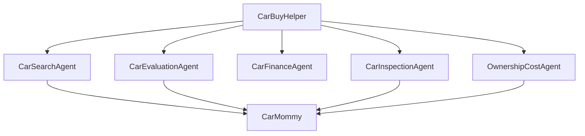
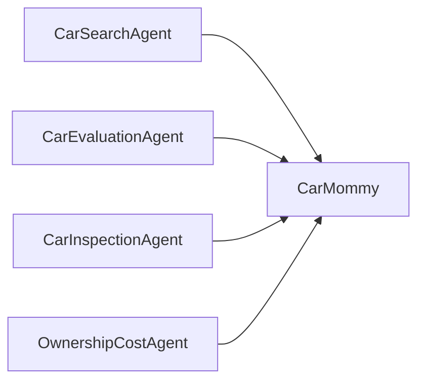
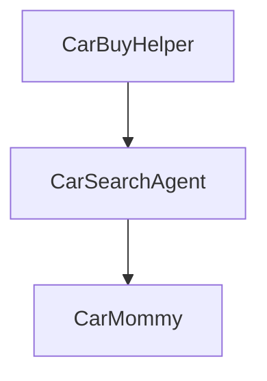
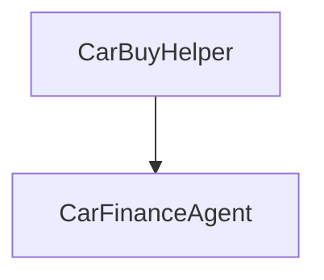
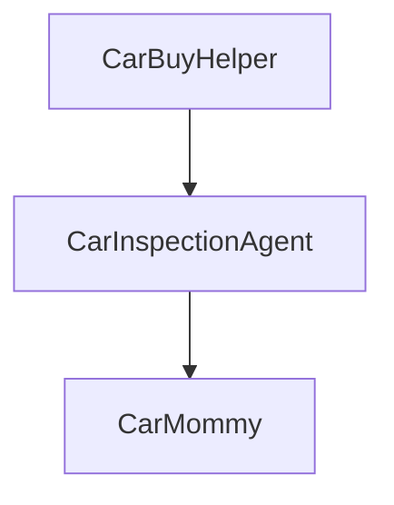
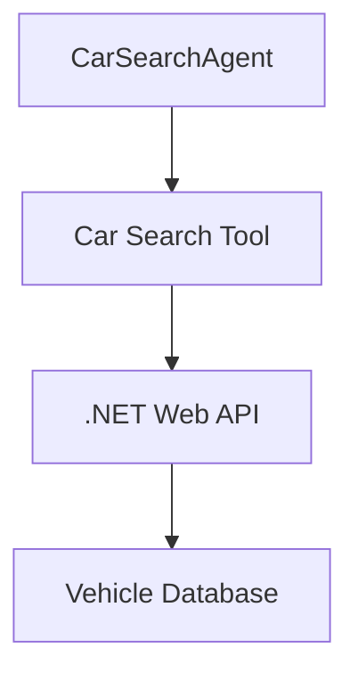
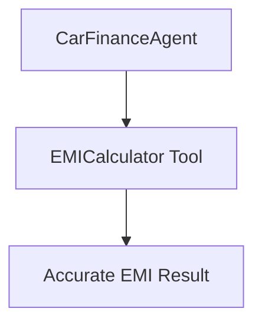
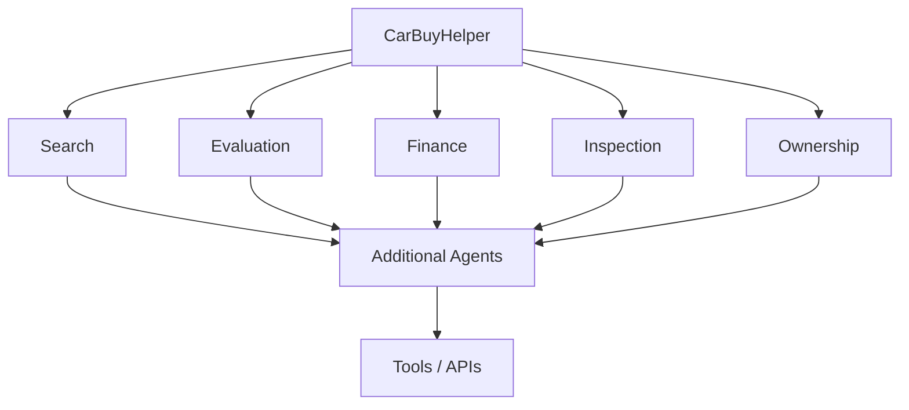

# AI Car Buying Assistant

## Overview

The AI Car Buying Assistant is a multi-agent system built using Neuro SAN Studio.

It helps users make informed decisions when buying new or used cars. The system uses a main orchestration agent, `CarBuyHelper`, which delegates user requests to specialized agents.

The assistant can help with:

- Finding suitable cars
- Evaluating used cars and asking prices
- Car loan and EMI calculations
- Used-car inspection
- Maintenance and ownership costs
- Comparing vehicles
- BUY / CONSIDER / NEGOTIATE / AVOID recommendations

The user interacts with `CarBuyHelper`; specialist agents work behind the scenes.

---

# Agent Architecture



The diagrams use GitHub-supported Mermaid syntax so they render as graphical diagrams in the README preview instead of relying on fixed-width ASCII spacing.

The exact visual arrangement is handled by Neuro SAN Studio.

---

# Agents

## 1. CarBuyHelper

### Role

`CarBuyHelper` is the main user-facing agent and orchestrator.

### Responsibilities

- Understand user requirements
- Identify the type of request
- Delegate to specialist agents
- Combine specialist responses
- Provide a final user-friendly recommendation

### Example

```text
User:
I found a 2020 Jeep Compass diesel automatic with
55,000 km for ₹13 lakh. Is it worth buying and what
will my EMI be?

CarBuyHelper
     |
     +----> CarEvaluationAgent
     |
     +----> CarFinanceAgent
```

---

## 2. CarSearchAgent

### Role

Finds cars matching user requirements.

### Criteria

- Budget
- Brand and model
- Variant
- Body type
- Fuel type
- Transmission
- Model year
- Maximum kilometers
- Location
- Number of owners

### Uses

```text
CarSearchAgent
       |
       v
   CarMommy
```

### Example Queries

```text
Find me an automatic SUV under ₹15 lakh.
```

```text
Find me a used diesel automatic SUV from 2020 or newer
with less than 60,000 km.
```

```text
Find used Jeep Compass diesel automatic cars from 2019
to 2022 with less than 70,000 km.
```

---

## 3. CarEvaluationAgent

### Role

Evaluates whether a used car is worth buying and whether the asking price appears reasonable.

### Evaluation Factors

- Model year
- Variant
- Asking price
- Kilometers
- Number of owners
- Fuel type
- Transmission
- Service history
- Common issues
- Maintenance requirements
- Resale value
- Market position

### Possible Verdicts

```text
BUY
CONSIDER
NEGOTIATE
AVOID
```

### Example

```text
I found a 2020 Jeep Compass 4x4 diesel automatic
with 55,000 km. The seller wants ₹13 lakh.
Is it worth buying?
```

The agent should explain positive factors, risks, price considerations, negotiation points, and the final recommendation.

A physical inspection should still be recommended before purchasing a used vehicle.

---

## 4. CarFinanceAgent

### Role

Handles the financial aspects of purchasing a car.

### Handles

- Car price
- Down payment
- Loan amount
- Interest rate
- Loan tenure
- EMI
- Total repayment
- Total interest
- Affordability

### EMI Formula

```text
EMI = P × r × (1+r)^n / ((1+r)^n - 1)
```

Where:

```text
P = Loan principal
r = Monthly interest rate
n = Number of monthly payments
```

### Example Query

```text
I want to buy a ₹12 lakh car.

I can pay ₹3 lakh as down payment.

Calculate the EMI for 5 years at 9% interest
and show the total interest.
```

### Important

The agent should clearly state that:

- Interest rates are assumptions unless supplied by the user
- Actual bank/NBFC rates may differ
- Processing fees may apply
- Insurance and other charges may apply
- Loan approval depends on lender eligibility

The agent should never guarantee loan approval.

---

## 5. CarInspectionAgent

### Role

Provides a practical checklist for inspecting a used car before purchase.

### Inspection Areas

**Exterior**
- Paint mismatch
- Panel gaps
- Accident damage
- Rust
- Flood damage

**Engine**
- Oil leaks
- Unusual sounds
- Smoke
- Warning lights
- Cold-start behavior

**Transmission**
- Gear shifting
- Jerking
- Delayed engagement
- Clutch behavior where applicable

**Suspension and Steering**
- Vibrations
- Steering pull
- Suspension noise
- Uneven tyre wear

**Brakes**
- Brake response
- Brake noise
- Disc and pad condition

**Tyres**
- Tread
- Uneven wear
- Tyre age

**Electronics**
- Air conditioning
- Infotainment
- Cameras
- Sensors
- Windows
- Lights

**Documents**
- Registration
- Insurance
- Service history
- Ownership history
- VIN/chassis details

**Test Drive**
- Cold start
- City driving
- Highway driving
- Braking
- Steering
- Transmission

### Example Query

```text
I am going to inspect a 2020 Jeep Compass diesel
automatic tomorrow. Give me a detailed checklist.
```

For an expensive used-car purchase, an independent mechanic inspection is recommended.

---

## 6. OwnershipCostAgent

### Role

Estimates the expected cost of owning a vehicle.

### Factors

- Fuel
- Annual kilometers
- Fuel price
- Insurance
- Scheduled maintenance
- Tyres
- Battery
- Repairs
- Spare parts
- Depreciation

### Possible Output

```text
Monthly ownership cost
Annual ownership cost
3-year ownership cost
5-year ownership cost
```

All estimates should clearly mention their assumptions.

### Example Query

```text
I drive around 1,500 km per month.

What could be the monthly and annual ownership
cost of a diesel SUV?
```

---

## 7. CarMommy

### Role

`CarMommy` acts as the underlying vehicle information and research assistant.

It can provide information related to:

- Car models
- Variants
- Specifications
- Model years
- Fuel types
- Transmissions
- Mileage
- Common problems
- Maintenance
- Used-car considerations
- Market information
- Vehicle listings when available

Multiple specialist agents can use `CarMommy`.



`CarFinanceAgent` does not need `CarMommy` for basic EMI calculations.

---

# Request Routing

| User Requirement | Agent |
|---|---|
| Find cars | CarSearchAgent |
| Search by budget/location | CarSearchAgent |
| Is this car worth buying? | CarEvaluationAgent |
| Is this price reasonable? | CarEvaluationAgent |
| How much should I negotiate? | CarEvaluationAgent |
| Calculate EMI | CarFinanceAgent |
| Compare loan tenures | CarFinanceAgent |
| How much down payment? | CarFinanceAgent |
| What should I inspect? | CarInspectionAgent |
| Used-car checklist | CarInspectionAgent |
| Expected maintenance cost | OwnershipCostAgent |
| Fuel + maintenance cost | OwnershipCostAgent |
| Long-term ownership cost | OwnershipCostAgent |
| Multiple requirements | Multiple specialist agents |

---

# Sample Queries

## Car Search

```text
Find me an automatic SUV under ₹15 lakh.
```

```text
Find me a used diesel automatic SUV from 2020 or newer
with less than 60,000 km.
```

```text
Find used Jeep Compass diesel automatic cars under ₹15 lakh.
```

## Used Car Evaluation

```text
Is a 2020 Jeep Compass 4x4 diesel automatic with
55,000 km worth buying?
```

```text
A 2020 Jeep Compass diesel automatic has 55,000 km
and the seller is asking ₹13 lakh. Is that a good price?
```

```text
The owner wants ₹12.5 lakh for a 2020 Hyundai Creta
diesel automatic with 60,000 km. How much should I negotiate?
```

## Finance

```text
I want to buy a car for ₹12 lakh.

I can pay ₹3 lakh as down payment.

What will my EMI be for 5 years at 9% interest?
```

```text
Calculate the EMI for a ₹10 lakh car loan at 9.5%
for 3, 5 and 7 years.
```

```text
If I take an ₹8 lakh car loan at 9% for 5 years,
how much total interest will I pay?
```

## Inspection

```text
What should I check before buying a used car?
```

```text
I am going to inspect a 2020 Jeep Compass diesel automatic.
Give me a detailed inspection checklist.
```

```text
How can I identify whether a used car has been involved
in an accident?
```

```text
What documents should I verify before buying a used car
from an individual seller?
```

## Ownership Cost

```text
How much can I expect to spend annually maintaining
a 2020 Jeep Compass diesel automatic?
```

```text
I drive around 1,500 km per month. What could be my
monthly running cost for a diesel SUV?
```

```text
Compare the expected fuel and maintenance costs of a
Hyundai Creta diesel and Jeep Compass diesel.
```

---

# Multi-Agent Demo Query

Use this query to demonstrate multiple agents being involved in one request:

```text
I am looking for a used SUV in Kerala.

My budget is ₹15 lakh.

I prefer an automatic diesel SUV from 2020 or newer
with less than 60,000 km.

I drive around 1,500 km per month.

Find suitable options, compare them, tell me which one
is the best buy, estimate the EMI if I pay ₹4 lakh down
payment, and tell me what I should inspect before buying.
```

Possible orchestration:


The main agent combines the results into one response.

---

# Five-Minute Demo Plan

## 0:00 – 0:30 — Introduction

Say:

> "This is a multi-agent AI Car Buying Assistant. CarBuyHelper is the main agent, and it delegates specialized tasks such as car search, evaluation, finance, inspection and ownership cost."

Show the Neuro SAN Studio graph.

## 0:30 – 1:10 — Car Search

Ask:

```text
Find me a used automatic diesel SUV from 2020 or newer
with less than 60,000 km under ₹15 lakh.
```

Point out:



## 1:10 – 1:50 — Used Car Evaluation

Ask:

```text
I found a 2020 Jeep Compass diesel automatic with
55,000 km. The seller wants ₹13 lakh.
Is it worth buying?
```

Point out the evaluation specialist.

## 1:50 – 2:30 — Finance

Ask:

```text
I want to buy a ₹12 lakh car. I can pay ₹3 lakh down.
Calculate the EMI for 5 years at 9% interest.
```

Point out:



## 2:30 – 3:10 — Inspection

Ask:

```text
I am going to inspect a 2020 Jeep Compass diesel automatic.
Give me a detailed checklist.
```

Point out:



## 3:10 – 3:50 — Ownership Cost

Ask:

```text
I drive 1,500 km per month.
What could be the monthly and annual ownership cost
of a diesel SUV?
```

Point out the ownership-cost specialist.

## 3:50 – 4:50 — Multi-Agent Scenario

Use the complete multi-agent query from above.

Explain:

> "This single request contains several different intents. CarBuyHelper can route the request to multiple specialists and combine their results."

## 4:50 – 5:00 — Closing

Say:

> "The architecture separates responsibilities between specialized agents while keeping a single conversational interface for the user."

Potential extensions:

- Real vehicle inventory API
- PostgreSQL/database search
- Real-time used-car listings
- Deterministic EMI calculator
- Insurance comparison
- Vehicle history lookup
- Service-cost database
- Market price analysis
- Dealer integration
- Test-drive booking

---

# Important Limitations

The current implementation is an AI agent demonstration.

If `CarMommy` is not connected to a live vehicle database or search API, vehicle listings and market prices should not be presented as real-time inventory.

For production:



For financial calculations, a deterministic calculator tool should be preferred over relying only on the LLM:



---

# Future Enhancements

Potential future specialist agents:

```text
InsuranceAgent
VehicleHistoryAgent
ResaleValueAgent
NegotiationAgent
DealerAgent
TestDriveAgent
CarRecommendationAgent
```

Future architecture:



---

# Summary

The AI Car Buying Assistant demonstrates how a multi-agent architecture can provide specialized assistance for vehicle purchasing.

The main principles are:

1. `CarBuyHelper` provides a single user-facing interface.
2. Specialist agents handle specific domains.
3. `CarMommy` provides shared vehicle information where required.
4. Multiple agents can be involved in a single user request.
5. The architecture can be extended with real APIs and deterministic tools.
6. The system should clearly distinguish verified information from estimates.
7. The assistant should help users make informed decisions rather than act as a salesperson.
